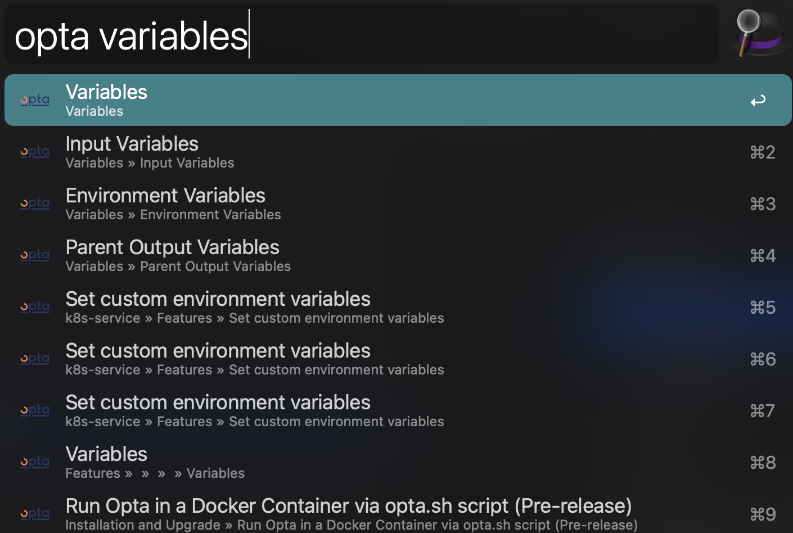

# OPTA Docs Workflow for Alfred

An ultra-fast OPTA docs search workflow for Alfred 4

Adapted from [Alfred TailwindCSS Docs](https://github.com/clnt/alfred-opta-docs), which is adapted from [Alfred VueJS Docs](https://github.com/vmitchell85/alfred-vuejs-docs), which is adapted from [Alfred Laravel Docs](https://github.com/tillkruss/alfred-laravel-docs), Thanks [Till Krüss](https://twitter.com/tillkruss)!



## Installation


> **macOS Monterey:** PHP is no longer shipped with macOS, before attempting to use this workflow ensure you have installed the php binary via Homebrew.

1. [Download the latest version](https://github.com/legovaer/alfred-opta-docs/releases/download/v1.0.0/OPTADocs.alfredworkflow)
2. Install the workflow by double-clicking the `.alfredworkflow` file
3. You can add the workflow to a category, then click "Import" to finish importing. You'll now see the workflow listed in the left sidebar of your Workflows preferences pane.

## Usage

To search the [opta docs](https://opta.com/docs), just type `opta` followed by your search query.

```
opta <query>
```


